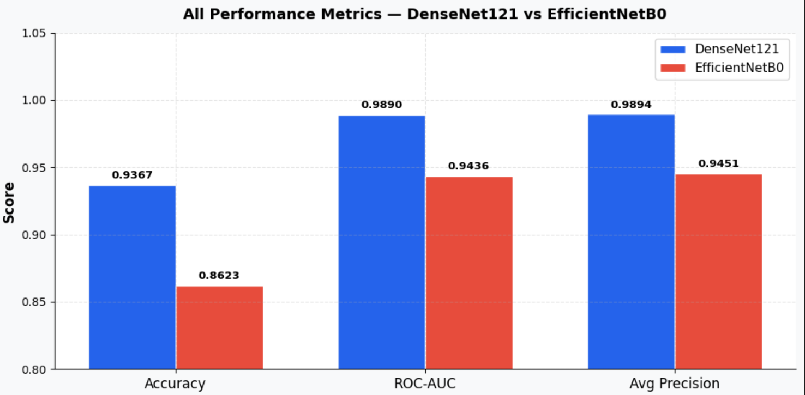
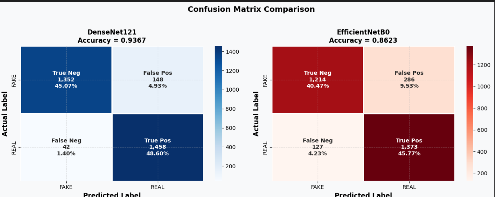
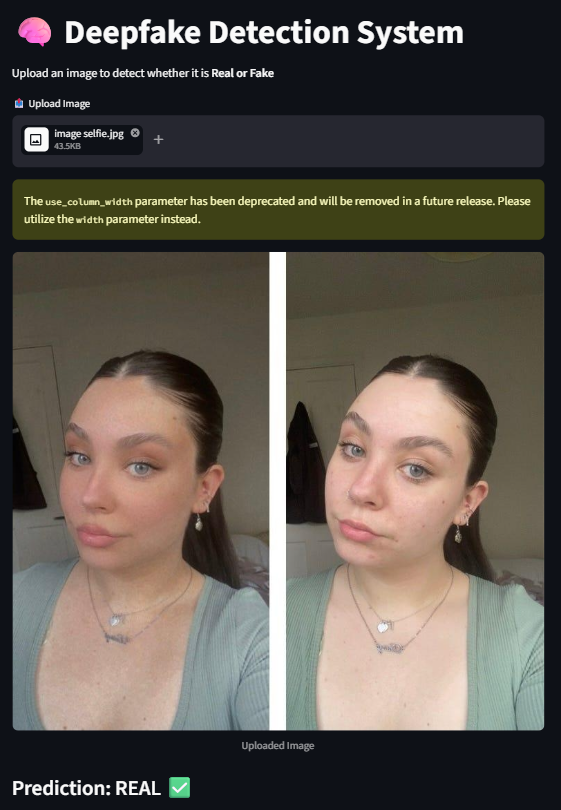

# 🧠 Deepfake Detection using CNN, DenseNet & EfficientNet


---

## 🚀 Overview
Deepfake detection is a critical problem in modern AI.  
This project compares multiple deep learning models to identify fake vs real images with high accuracy.

---

## 🏗️ Models Used
- 🧩 **Custom CNN** – Baseline model  
- 🧠 **DenseNet121** – Best performing model  
- ⚡ **EfficientNetB0** – Lightweight alternative  

---

## 📊 Results

### 🔹 Model Performance Comparison


### 🔹 Confusion Matrix Comparison


📌 **Key Result:**  
DenseNet121 achieved the highest accuracy (~93%) and showed the lowest misclassification rate.

---

## 💻 Demo / Output


Users can upload an image and instantly get:
- Prediction (Real / Fake)
- Confidence Score

---

## ⚙️ Tech Stack
- Python  
- TensorFlow / Keras  
- OpenCV  
- Matplotlib  

---

## 📦 Installation
```bash
pip install -r requirements.txt
